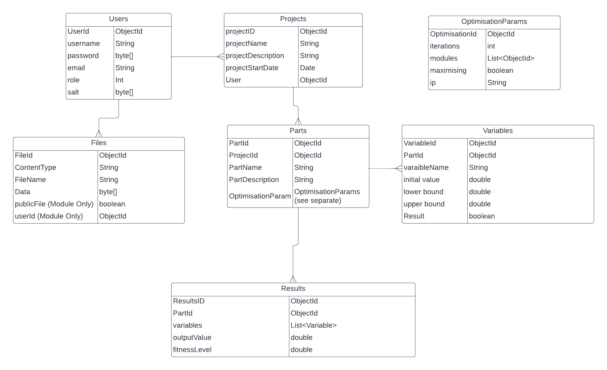

# In-Depth Explanation

This document will explain the file structure, design decisions of the project and give an overview of how it works. All the code is commented so information on how specific functions and classes work will be within the source code files.

## Design Decisions

### Why use a Web-App?
This is explained in the [PossibleSoultions.md](/PossibleSolutions.md).
A quick summary:
* Full graphical user interface.
* Easily accessible through the web browser.
* Compatible with any OS.
* Little maintenance needed.

Another benefit is that in the future it will be possible to convert it to dedicated desktop apps if desired.

### Web-App framework
To make the web-app we used the spring-boot framework. Frameworks provide basic functionality such as server functions, template of the model view controller architecture, testing framework etc. We used Thymeleaf as a HTML template engine as it is commonly used with spring-boot. Other template engines can be used instead.
The chosen framework will dictate the file structure of the project, though most are fairly similar. 

#### Why spring-boot?
We chose to use the spring-boot framework for the following reasons:
* It has a large well supported community.
* It uses Java, which is a fast commonly used language.
* It is fairly easy to use and adapt.

Other frameworks can easily be used instead. Another strong alternative would be Django which uses python. 

### Database
We chose to use MongoDB as our database for the following reasons. 
* It is a no-SQL database meaning there is no rigid structure for the data. This means it is easy to store different types of data such as files, integers, strings, floats etc. 
* It is quick and easy to prototype with.
* It works well with java and python.
* It is very scalable so it can be used into the future of the project.
* It is popular so there are lost of resources online for how to use it well.

It is possible to use any database of your choosing which may make it easier to integrate with current systems. The repository and service files will need to be replaced to do so. 

We have also set up provisions for a cloud database system, as well as a locally run database system. Each have they're own advantages with local systems being able to be run without internet connection, and also useful for a locally run server, whereas the cloud system is vastly better for deploying the system on the web, and for scaling up the amount of data stored. Developers taking on the project have a choice of which to use based on the development they are doing.

Below is an image displaying the design and entity relations of the database collections: 

### Running the Modules
The module will be run using the network. This is so that the modules can be run locally, over the network or the internet. It also allows for much easier interactions between the web-app and the modules through the use of API's.

The Java backend can send any type of file, and any number of files in a POST request to a module. At the moment it sends a json file of variables to the fake module, which then parses the file and executes the calculation. It also sends a python file which is unused but in the future could be used. Sending the python file is a demonstration of how you could send extra files as well. 

Json was chosen as it is a very popular, simple and widely used format to send data across a network. There are many libraries in every programming language which can parse json files so very little custom code will need to be written to read or write the json files.

Currently the system works by sending the data to an api endpoint in the python backend which only performs one function. It needs to be expanded to be able to run any module.
Modules in the future can be run in one of two ways: 
* The Java backend will send the module file to an api which will take the json data and the module. It will then run the module as a sub-process using the json data as input.
* The api will have different end points for different modules and the json data is sent to the endpoint for the module that needs to be run.

### Optimisation Algorithm
For the optimisation algorithm we chose a basic Hill climbing algorithm. As the name suggests, the algorithm uses an iterative technique to "climb a hill" where the peak of a hill represents an optimal solution. The way the algorithm has been implemented is by starting at an arbitrary solution, and at each iteration making small changes to try and produce a better solution. This means that over a long series of solutions it is able to make a series of fine changes to come to an optimal or almost optimal solution no matter the starting values. 

We chose this as our initial optimisation algorithm mainly because it allowed us to differentiate problems into 2 categories, minimisation and maximisation. This means that our algorithm is able to work towards an unknown minimum/maximum value, which is ideal for optimisation problems that the NCC requires to be solved. In future iterations of this application/project, an updated system would allow users to select from a vast array of different optimisation techniques, each one would have its applications to different types of problems.

### CI/CD
The github repository uses actions to continually integrate and deploy the application to AWS. This means that everytime a change is made to the `dev` branch, all the code in both the python and java applications is tested. This is an automated process which allows multiple developers to merge their code and ensure they are not impacting already written and working code, and are ensuring they have passed all tests before code is allowed to be merged with working code. 

On top of this, we have decided to use AWS to host our web application. This is done through a process called Continuous Deployment/Delivery, which means that everytime code is pushed to the `dev` branch, it is dockerised into two separate containers, and pushed to a repository on AWS. From there, code is then unpackaged and run on an Elastic Container Service, and available to any user who wants to access it. This process means that once code has been updated and integrated, it is automatically uploaded to a cloud server without any downtime. We decided to do this as a proof of concept that the application could be deployed and accessed on a cloud, but provisions are still there for users/clients to run the applications locally.

## Overall Structure 
The project's structure has been mostly dictated by the chosen framework spring-boot. Here is an overview of the folders and what they contain, as well as any files. 
#### The .github folder
Contains templates for issues and pull requests to maintain consistency. Workflows are also stored here as a series of `.yml` files which document how the code is tested, built, dockerised and pushed to AWS to create a CI/CD pipeline. These do not impact how the project or code run.
#### The AWS folder
Contains a series of `.json` files used by the `aws.yml` file to push images to AWS. These do not impact the code or how the project runs, and should not be altered unless using AWS.
#### The Assets folder
Contains images and other assets used in the documentation files and the readme. These do not impact the code or how the project runs.
#### The Documentation folder 
Contains the documentation (other than the readme).
These files do not impact the code or how the project runs.
#### The Python Backend folder
Contains all the source code used in the python backend. This code is used as a stand in for the modules.
#### The src folder
Contains the source code for the spring-boot web-app. Src stands for source.
#### The target folder 
Contains the compiled code from the src folder. It is not necessary to modify anything in this folder.
#### Dockerfile
This file allows the project to be dockerised. There are two dockerfiles in the project. One is not in a folder and is used to dockerise the web-app. The other is within the python backend folder and is used to dockerise the python backend. Currently the web-app docker file is not configured to ignore the python backend and it will include it in the container it produces. This makes the container larger than necessary but does not affect the overall function of the container. This container cannot be used as the python backend as the correct ports are not open and the python_api.py file will not be run when starting the container.

Dockerisation turns the source code into container which can be easily loaded onto any computer and run. The container will usually be a disk image.
#### mvnw and mvwn.cmd
The mvnw file is a maven wrapper which allows for maven commands to be run without installing maven. It is a lightweight version of maven, if you are developing with maven you will need to install the full version.
#### pom.xml
The pom.xml file (Project Object Model) is the main configuration file and contains dependencies, plugins, build settings and other project details.  

## Java-Backend
The Java backend source code is located in the src folder.

### test folder
Contains code used to test the code written in main. It does not affect the function of the web-app but the tests are useful to know if the code written in main is correct or not. For testing the database, the system uses a dockerised mongodb container, which runs locally on the machine and therefore does not interact with any actual data.

### main folder
Contains the source code of the web-app.

#### java\UoBToolchainGroup\DistributedToolchainIntegration
Contains all java source code for the project. An explanation of each folder and class within this folder will be below under the Java Source Code title.

#### resources
Contains resources that are used in displaying the page in the web browser. When a resource is needed it is loaded from this folder and the necessary data is injected into the page before it is served to the user. For example the page error.html (in templates) provides a template for the error page. If an error occurs it is loaded and the information for the specific error is injected into the html where the ${err} element is. The styling for the page is loaded from the static folder. Thymeleaf is responsible for injecting the data into the page.

The following folder and files are located within the resources folder.
* static - Contains the css used to style the web page.
* templates - Contains the html used to format the webpage.
* application.properties - Contains information on the application properties, particularly for defining where the database is to be accessed. Currently there are provisions that allow developers to switch between a cloud based database, and a local database depending on the type of developement needed.

## Python Backend

#### modules folder
Contains a module that has basic functions for testing purposes. To be clear this is not meant to represent simulation software.

#### __init__.py
This file is used to help python discover relevant files and import necessary modules.

#### Dockerfile
This file is used to create a container for the whole python backend. 

#### python_api.py
This file represents an api for the simulation software. It uses a flask server which is lightweight but should **NOT** be used in a production environment as it is not scalable, is very minimalistic so you will need to extend it for more features, leaves security up to the developer entirely and requires more maintenance. It is however very easy to test and prototype with making it ideal for this purpose.

#### requirements.txt
Contains a list of all the dependencies in the python backend. 

#### test_api.py
A file used to unit test the python_api.

## Java Source Code

The java source code is split into folders. To better understand this section an understanding of the Model-View-Controller Architecture will help. Find a link to a helpful resource [here](https://developer.mozilla.org/en-US/docs/Glossary/MVC). At a very basic level, the user will send input to the controller. The controller will update the model and then the model will update the view. The view updates what is displayed onto the screen.

### Controller folder 
Contains all the controllers. Controllers handle user input and update the model accordingly.

### Model folder
Contains all of the Models. These will handle data for the application and update the view.

### Repository Folder
Contains files which handle data access logic, such as CRUD operations, for interacting with the database (in this case, MongoDB).

### Service
Contains files which implements business logic, orchestrates interactions with the repository layer, and provides higher-level operations or processes.

### DistributedToolchainIntegrationApplication.java
When this file is run it starts the whole application.

### HillClimb.java
This file is responsible for the optimisation of the parts. It will connect to the modules and make api calls to simulation software.
